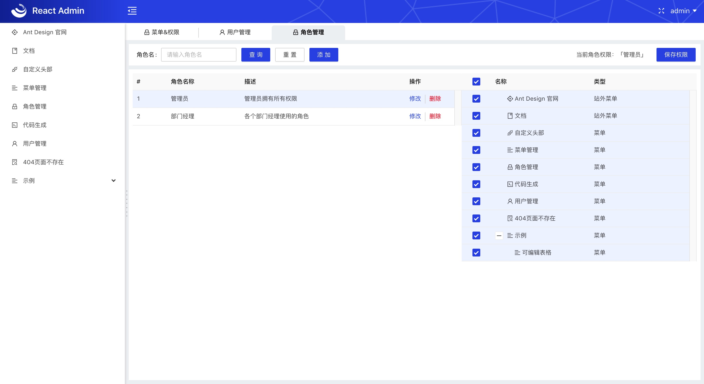
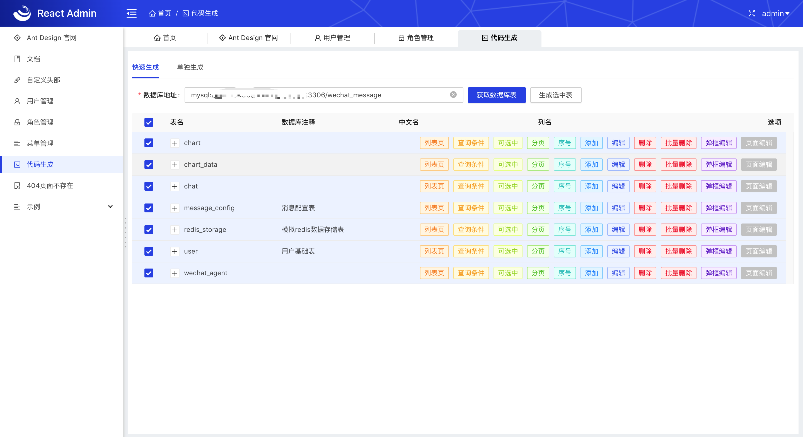
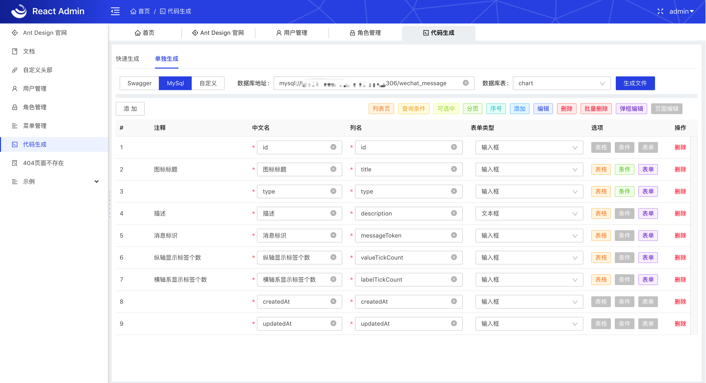

# React Admin
基于[React](https://reactjs.org)、[Ant Design](https://ant.design/)的管理系统架构。让开发人员专注于业务，其他琐事，交给框架！

感谢开源社区，感谢Ant Design团队提供优秀的开源项目！

如果帮助到了您一点点，star 一下吧 🙂

## 特性

- 菜单配置：扁平化数据组织，方便编写、存库，页面菜单、标题、面包屑状态自动同步；
- 页面配置：提供配置装饰器，页面功能配置化；
- 系统路由：简化路由配置，一个变量搞定；
- Ajax请求：restful规范，自动错误提示，提示可配置；自动打断未完成的请求；
- Mock模拟数据：无需等待后端，自己提供数据，简化mock写法；
- 样式&主题：Less简化css编写，CSS Module防冲突，用户可自定义主题颜色；
- 导航布局：多种导航方式，一键切换；
- Model(Redux)：简化Redux写法，配置化同步LocalStorage；
- 权限控制：菜单级别、功能级别权限控制；
- 代码生成工具：CRUD基础一键生成，提高开发效率；
- 内置组件：modal封装解决脏数据问题、可编辑表格、Form表单元素封装等等；
- ......

系统提供了一些基础的页面：

- 登录
- 修改密码
- 菜单编辑
- 用户管理
- 角色管理
- ......

## 快速开始

Step 1：将此项目下载到本地
```bash
$ git clone https://github.com/sxfad/react-admin.git
```

Step 2：安装依赖
```bash
$ cd react-admin 
$ yarn 
```
注：如果由于网络原因，下载依赖比较慢，可以使用淘宝镜像：`yarn --registry=https://registry.npm.taobao.org`；

Step 3：运行
```bash
$ yarn start
```

## 创建一个页面
Step 1：在`src/pages`目录下新建文件 `MyTest.jsx`，内容如下：
```jsx 
import React, {Component} from 'react';
import config from 'src/commons/config-hoc';
import PageContent from 'src/layouts/page-content';

@config({
    path: '/my-test'
})
export default class MyTest extends Component {
    state = {};

    componentDidMount() {

    }

    render() {
        return (
            <PageContent>
                我的第一个页面
            </PageContent>
        );
    }
}
```
函数式写法：
```jsx
import React from 'react';
import config from 'src/commons/config-hoc';
import PageContent from 'src/layouts/page-content';

export default config({
    path: '/my-test',
})(() => {
    return (
        <PageContent>
            我的第一个页面
        </PageContent>
    );
});
```

浏览器访问 `http://localhost:4000/my-test`

此时tab页签应该是空的，配置菜单之后就能正常显示title了，或者在`@config`配置中添加`title`属性。

Step 2：添加菜单
在 `src/menus.js`文件中添加前端硬编码的菜单配置
```javascript
export default function getMenus(userId) {
    return Promise.resolve([
        {key: 'my-key', text: '我的测试页面', icon: 'user', path: '/my-test'},

        {key: 'antDesign', text: 'Ant Design 官网', icon: 'ant-design', url: 'https://ant-design.gitee.io', target: '', order: 2000},
        {key: 'document', text: '文档', icon: 'book', url: 'http://shubin.wang/docs', target: '_blank', order: 1200},

    ]);
}
```

路由的配置、菜单的关联等等，系统会帮我们处理，新建一个文件，即创建了一个页面。更多丰富的功能[请戳文档](http://shubin.wang/docs)

## 文档地址
最新文档[戳这里](http://shubin.wang/docs)

## 项目预览
预览地址[戳这里](http://shubin.wang)

注：用户名、密码随意输入

## 项目截图
这里只提供了部分页面截图，根据文档[快速开始](http://shubin.wang/docs/#/START)进行项目的搭建，浏览项目丰富功能！







如果帮助到了您一点点，star 一下吧 🙂

## License

React Admin is licensed under the [Apache License](https://github.com/sxfad/react-admin/blob/master/LICENSE)
