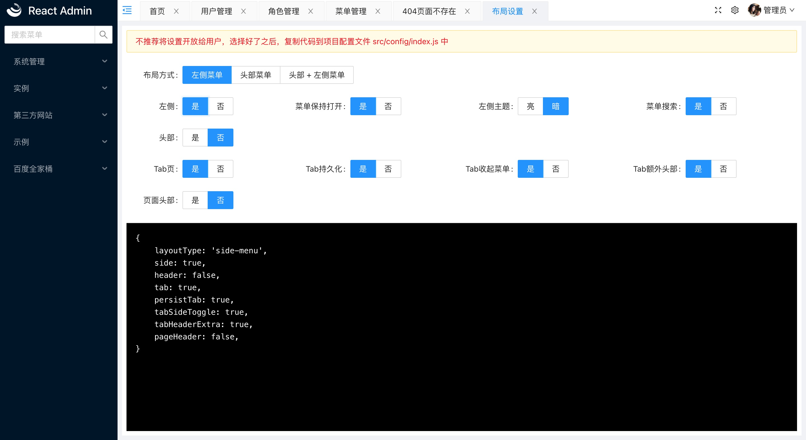

# 简介

react-admin是基于[React17.x](https://reactjs.org)、[Ant Design4.x](https://ant.design/)的管理系统架构。
采用前后端分离，内置了许多管理系统常用功能，通过一些脚本、封装帮助开发人员快速开发管理系统，集中精力处理业务逻辑。

## 项目结构

```
.
├── build               // 构建生成的静态文件目录
├── docs                // 说明不稳当
├── node_modules        // 项目依赖
├── public              // 静态文件，非webpack构建文件，构建时会原样copy到build目录中
├── src                 // 项目源码目录
│   ├── commons         // 项目公共文件目录，一些公共js
│   ├── components      // 项目公共组件
│   ├── config          // 项目配置
│   ├── mock            // 开发时mock数据
│   ├── models          // 数据管理，基于redux，复杂的页面会用到
│   ├── pages           // 页面文件
│   ├── router          // 路由相关
│   ├── App.jsx         // 根组件，做一些项目一些初始化工作
│   ├── App.less        // 全局样式
│   ├── index.js        // 项目入口文件
│   ├── menus.js        // 菜单配置文件
│   ├── reportWebVitals.js
│   ├── setupProxy.js   // 开发模式，接口对接代理设置
│   ├── setupTests.js   // 测试相关
│   └── theme.less      // 主题变量
├── craco.config.js     // webpack等构建相关配置
├── package.json            
├── README.md
└── yarn.lock
```

## 预览

部分页面截图，完整项目预览地址[戳这里](https://sxfad.github.io/react-admin/build/#/login)
<div style="background: #efefef;padding: 0 10px;">





</div>

